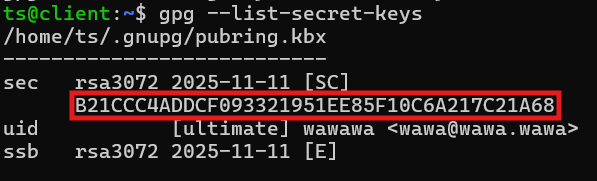

# Duplicity

[https://duplicity.nongnu.org/vers7/duplicity.1.html](https://duplicity.nongnu.org/vers7/duplicity.1.html)

Bon c parti dcp on commence direct (faut pas refaire ce qui est écrit hein c juste pr moi)

```bash
gpg --full-generate-key
```

pr export vers le client

```bash
gpg --armor export <mail> > public.asc
```

sur le client

```bash
gpg import public.asc
```

```bash
duplicity --encrypt-key <mail> /etc scp://<client_id>@backup-server//home/backup/<client_id>
```

```bash
duplicity scp://backup@backup-server//home/backup/client1 /restore
```

```bash
gpg --list-secret keys
```



```bash
gpg --armor --export-secret-keys ... private_backup_key.asc
```

Not relevant don’t touch pls or i’ll be sad

```json
FILES="[]"
if [ -d "$SOURCE_DIR" ]; then
  FILES=$(find "$SOURCE_DIR" -type f | while read -r f; do
    NAME=$(basename "$f")
    SIZE=$(stat -c%s "$f")
    jq -n \
      --arg file_name "$NAME" \
      --argjson file_size "$SIZE" \
      --arg status "$STATUS" \
      '{file_name: $file_name, status: $status, file_size: $file_size, error: null}'
  done | jq -s '.')
fi

JSON_LOG=$(jq -n \
  --arg client "$CLIENT_ID" \
  --arg backup_id "$BACKUP_ID" \
  --arg timestamp "$DATE" \
  --arg status "$STATUS" \
  --arg duration "$DURATION_FMT" \
  --argjson size "$ARCHIVE_SIZE" \
  --argjson files "$FILES" \
  '{client: $client, backup_id: $backup_id, timestamp: $timestamp, status: $status, size: $size, duration: $duration, files: $files, error: null}')

LOG_JSON_FILE="$LOG_FOLDER/$BACKUP_ID.json"
echo "$JSON_LOG" > "$LOG_JSON_FILE"
```